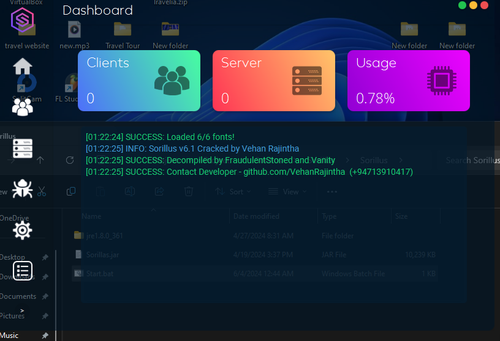

# Sorillus 6.1 Cracked 🔥

 

Welcome to the Sorillus 6.1 Cracked repository! Please note that the information provided here is for educational purposes only. 📚💡

Go to the bottom to join the telegram for the download and many more coming in the future. 🚀🔗

## About Sorillus ℹ️🔒

Sorillus is a platform-independent Remote Access Trojan (R.A.T) written in Java. It is designed to provide pentesters with full remote access to a variety of devices, including Linux, macOS, and Windows systems. The developer of Sorillus has even hinted at the possibility of a future version capable of hacking Android devices, expanding its cross-platform capabilities. 🌐🔓

## Features ✨🔧

Sorillus comes packed with powerful features that allow you to have extensive control over the target machine:

- **Keylogging**: Capture every keystroke made on the target machine, granting you access to sensitive information such as passwords and credit card numbers. ✅🔑💳

- **Remote Desktop**: Take complete control of the target machine's desktop, enabling you to perform actions as if you were physically present. ✅💻🔒

- **File Manager**: Browse and download files from the target machine, giving you access to important documents, images, and various other file types. ✅📂💾

- **Webcam Capture**: Capture snapshots or record video from the target machine's webcam, allowing you to discreetly observe your target's activities. 📸👀

## Getting Started 🚀📝

## Download
# Click on the below Mediafire icon to Download

Remember to use this software responsibly and only in authorized testing scenarios. We are not responsible for any misuse or illegal activities conducted using Sorillus.

